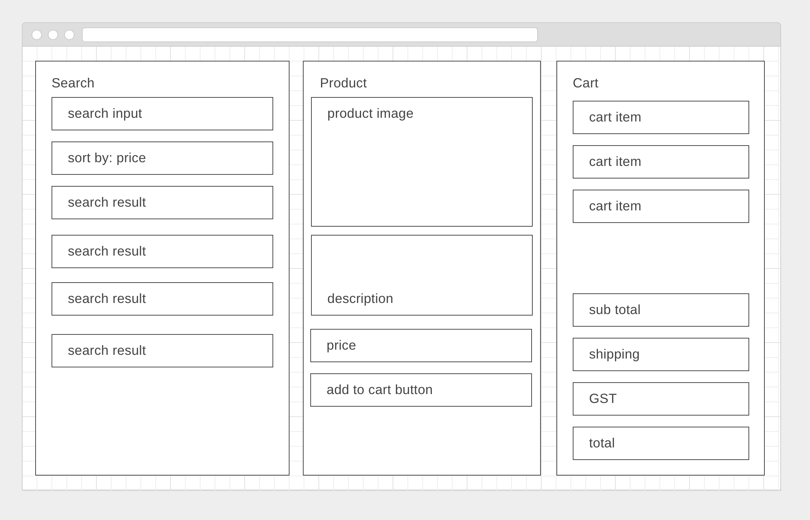

# shopping react app



Create a shopping app for walmart products.

There should be 3 main components:

1. A search component
  - search for a product and display the results
  - clicking on a product causes the product window to display/be filled
  
2. Product display component
  - displays information about the product
  - has a button to add to cart
  
3. Cart component
  - displays everything that was added to the cart
  - calculates subtotal, GST and shipping (flat $7)
  
Add bootstrap to your app if you like.

#### further
Add a carousel component to your app to display all the product images. Perhaps slick carousel npm library: https://github.com/akiran/react-slick
  
#### further
Add a sorting function to the search page. (just sort the results you currently have)

#### further
When the add to cart button is clicked again, add another item to the cart.

#### further
Let the user take things back out of the cart

#### further
Make each item in the cart a link. When the user clicks an item it opens in the product display tab.

#### further
Change the layout of the app to have only 2 columns. Add CSS to make the cart `position:absolute`. When something is added to the cart, make the cart display. Add a button inside the cart to hide it.

#### further
Paginate your search results.

#### further
Add more of the search result attributes into the product page.

#### further
Adjust the shipping cost according to the item added to the cart.

### `this` keyword with XML HttpRequest
With `XMLHttpRequest` we set the response text using `this` keyword.
```
function reqListener () {
  console.log(this.responseText);
}

var oReq = new XMLHttpRequest();
oReq.addEventListener("load", reqListener);
oReq.open("GET", "http://www.example.org/example.txt");
oReq.send();
```

If we want to set state in a react component method we need to have access to `this` keyowrd when it is the *react* `this`.

Just create a new variable that has the *react* `this` keyword value. 
```
componentDidMount(){

  //copy the value of this in order to refer to it in another way.
  var reactThis = this;
  
  function reqListener () {
   console.log(this.responseText);
   
   //transform the response to real js objects
   const data = JSON.parse( this.responseText );
   
   // here, we can't do this.setState
   
   //refer to react state instead
   reactThis.setState({queryData:data});
  }

  var oReq = new XMLHttpRequest();
  oReq.addEventListener("load", reqListener);
  oReq.open("GET", "http://www.example.org/example.txt");
  oReq.send();

}
```

### Express Server Proxy
You are provided with an API proxy route to use. Look at what it does here: https://github.com/wdi-sg/shopping-react/blob/master/src/server/controllers/query.js

You would make a request to the server with a url that looks like this: `http://localhost:3000/api/query?search=bananas`

You must fill in an API key.

You can register for one here: https://developer.walmartlabs.com/member/register
(you don't need a real website to register)

## Technologies

- React (v16)
- Express.js (v4) as production and development server
- Webpack 4 (production and development configurations)
- SCSS support (+ sanitize.css included)
- ES2015+

## Features
- preconfigured router
- React Material UI example theme
- preconfigured modal windows
- preconfigured eslint and Prettier code formatter
- React Hot Loader
- Linux/MacOS/Windows

## Usage

### Make sure you have nodemon installed globally
```
npm install -g nodemon
```

### Installation
```bash
git clone git@github.com:antonfisher/react-express-webpack.git
cd react-express-webpack
npm install


# remove boilerplate git references
rm ./.git
```

### Scripts
```bash
# run development mode
npm run dev

# run production mode
npm run build
npm start

# run prettier
npm run prettier

# run lint
npm run lint

# run on a different port
HTTP_PORT=3001 npm run dev
```

## License
MIT License. Free use and change.
